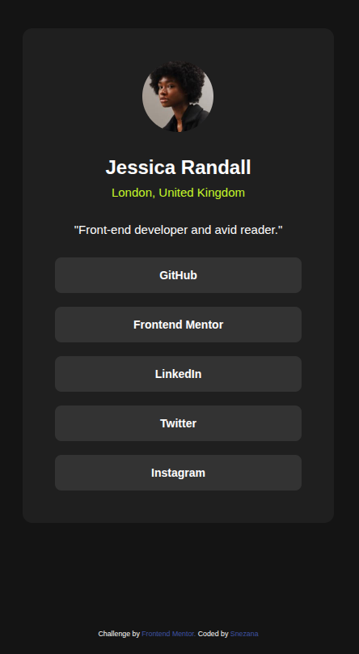

# Frontend Mentor - Social links profile solution

This is a solution to the [Social links profile challenge on Frontend Mentor](https://www.frontendmentor.io/challenges/social-links-profile-UG32l9m6dQ). Frontend Mentor challenges help you improve your coding skills by building realistic projects. 

## Overview

### The challenge

Users should be able to:

- See hover and focus states for all interactive elements on the page

### Screenshot




### Links

- Solution URL: [Add solution URL here](https://github.com/gsnezana7/social-links-profile)
- Live Site URL: [Add live site URL here](https://gsnezana-social-links.netlify.app/)

## My process

### Built with

- Semantic HTML5 markup
- CSS custom properties
- BEM Methodology
- Flexbox
- [Vue.js 3](https://vuejs.org) - JS Framework (Composition API)
- [Vite](https://vitejs.dev) - Build Tool
- Fluid Design with CSS `clamp()`

### What I learned
In this project, I practiced a modern "fluid design" approach. Instead of using multiple media queries, I implemented the `clamp()` function for responsive sizing, which allows the card and its paddings to scale smoothly between mobile and desktop resolutions:

```css
.card {
  max-width: clamp(20.5rem, 17.1rem + 14.5vw, 24.06rem);
  padding: clamp(1.563rem, 0.67rem + 3.8vw, 2.5rem);
}
I also used Vue 3 with a component-based architecture to separate data from the UI.

### Continued development

## Author

- Frontend Mentor - [@gsnezana7](https://www.frontendmentor.io)


